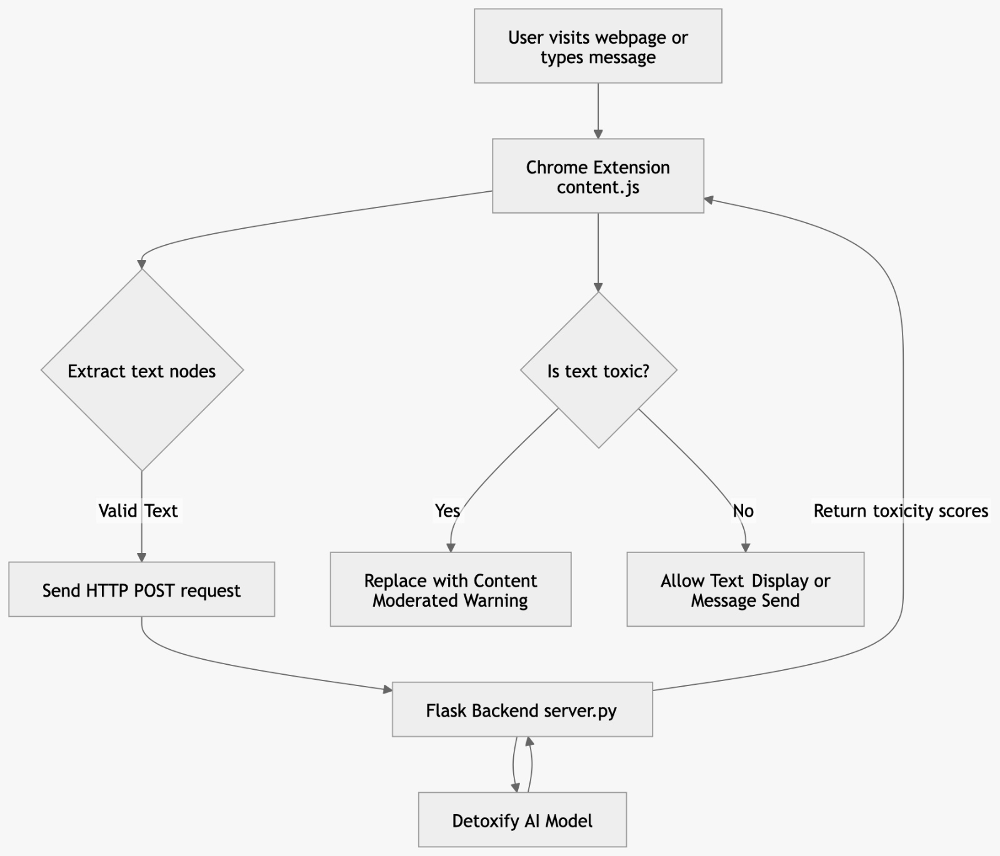

ToxiGuard – AI Content Moderator
ToxiGuard is a browser extension paired with a local AI server that detects and filters toxic language in real time.
It helps create a safer browsing environment by moderating harmful content and providing parental control features.
The system uses an AI toxicity detection model to analyze webpage content and user messages before they are displayed or sent.

I. Setup and Installation Guide:
Follow these steps to run the project locally.
Prerequisites
Before running the project, ensure you have:
1. Python 3 installed
2. Google Chrome or any browser installed
3. Git installed
4. Visual Studio Code installed

Step 1 – Clone the Repository
git clone https://github.com/yourusername/toxiguard.git
cd toxiguard

Step 2 – Backend Setup (Flask + AI Model)
1. Open a terminal in the project directory and install required dependencies:
pip install flask flask-cors detoxify torch
2. Run the server:
python server.py
3. The backend will start at:
http://127.0.0.1:5000

Step 3 – Load the Chrome Extension
1. Open Google Chrome
2. Go to chrome://extensions/
3. Enable Developer Mode
4. Click Load Unpacked
5. Select the extension folder containing:
manifest.json
content.js
popup.js
popup.html

The ToxiGuard extension will now appear in your browser toolbar.


II. Project Architecture
ToxiGuard consists of three main components:
1. Frontend:
Responsible for:
- DOM manipulation
- Detecting user input
- Injecting moderation warnings
- Extension popup interface
Key files:
manifest.json
content.js
popup.js
popup.html

2. Backend:
A Flask-based REST API running locally that processes text analysis requests.
Server address:
http://127.0.0.1:5000

Endpoint used:
/analyze

The backend receives text from the extension and returns toxicity scores.

3. AI Engine
The system uses the Detoxify multilingual model to evaluate whether a text is toxic or not.
Works in english and hindi.

4. Activity Diagram:
Code:
```
flowchart TB
    subgraph Frontend Components
        UI[Popup Interface<br>popup.html / popup.js]
        Core[Content Script<br>content.js / content.css]
        Config[(Extension Config<br>manifest.json / Storage)]
    end

    subgraph Backend Components
        App[Flask Server<br>server.py]
        ML[Toxicity Engine<br>Detoxify Multilingual]
    end

    UI <-->|Updates toggles / Passwords| Config
    Core <-->|Reads active mode| Config
    Core <-->|HTTP REST API| App
    App <-->|Loads & Predicts| ML
```
Diagram: 


5.DFD:
Code:
```
flowchart TD
    subgraph Client [Chrome Browser]
        User((User))
        DOM[Webpage DOM]
        Ext[Chrome Extension - content.js]
        Storage[(Local Storage)]
    end
    
    subgraph Server [Local Backend]
        API[Flask API - port 5000]
        AI[Detoxify AI Model]
    end

    User -->|Visits site / Types message| DOM
    DOM -->|Extracts text nodes > 3 chars| Ext
    Ext <-->|Read/Write KidMode settings| Storage
    Ext -->|POST /analyze JSON payload| API
    API -->|Passes text string| AI
    AI -->|Returns toxicity scores| API
    API -->|JSON Response: severity level| Ext
    Ext -->|Modifies DOM / Blocks Message| DOM
    DOM -->|Displays UI warnings| User
```
Diagram:



III. Key Functionalities
1. Real-time Webpage Scanning:
The extension scans webpage text nodes and analyzes them for toxic content.
If harmful language is detected, it replaces the text with a [Content Moderated] warning badge.
2. Outbound Message Protection:
ToxiGuard intercepts form submissions and user text inputs.
Messages are analyzed before sending and the system can:
-Warn users about harmful language
-Block the message if strict filtering is enabled
3. Kid Safe Mode & Parental Controls:
A password-protected Safe Mode enforces strict filtering rules.
Features include:
-Blocking toxic messages completely
-Automatically scanning webpages
-Preventing harmful content from being displayed
-Default password: 1234
4. Multilingual Toxicity Detection:
ToxiGuard supports toxic language detection in both English and Hindi.
Using the Detoxify multilingual model, the system can analyze text across multiple languages and detect abusive or harmful phrases.
This ensures better moderation across diverse online communities.


IV. AI Usage
Tools used:
1. Lovable ai
-Used to develop the base of the code
2. chatGPT
-Used to help develop code
3. Gamma 
-Used to help develop presentations 
4. gemini
-Used to help write the ReadMe.
-Help with diagrams.
5. detoxify:
-Analyze text content
-Generate toxicity scores
-Identify harmful language patterns.
6. Mermaid Ai:
-Used to help generate DFD and activity diagram